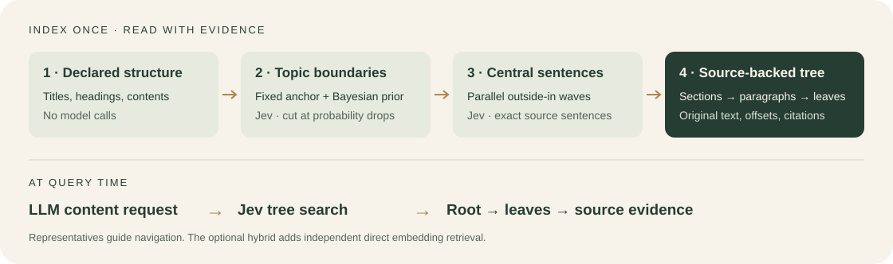

<div align="center">
  
  <h1>0halluciation drift indexing</h1>
</div>

Our index is a pure decision model based method with **0 LLM and optional embedding intervention**.

<p align="center">
  
  
  
  
</p>

<p align="center">
  <a href="#quick-start">Quick start</a> ·
  <a href="#measured-performance">Measured results</a> ·
  <a href="docs/algorithm.md">Algorithm</a> ·
  <a href="#parallel-processing-optimization">Parallel processing</a> ·
  <a href="docs/retrieval.md">Retrieval</a> ·
  <a href="CONTRIBUTING.md">Contributing</a>
</p>

**Reliable decisions with a purely statistical prior.** Jev scores whether paragraphs share a topic; an explicit Bayesian prior and a probability-drop rule determine where to cut. This makes document blocking a combination of learned decisions and transparent statistical rules, with no generative LLM calls during indexing and no required embedding model.

Headings and contents supply the upper structure without model calls. Jev then selects representative sentences directly from each topic block and paragraph using parallel outside-in search. The resulting content tree supports retrieval-augmented generation (RAG): an LLM proposes the content it needs, Jev searches from the root to sentence leaves, and the reader opens the selected source passages. The contribution is how topic blocks are formed; the tree is how those blocks are organized for retrieval.

“0 LLM” means no **generative LLM calls during indexing**. Jev is a learned decision model; the query-time LLM is separate. The project name expresses the aim of source-grounded retrieval, not a guarantee of error-free decisions or answers.



## Measured performance

The completed comparison below evaluates Jev blocking with its statistical cut rule against recursive and embedding-based semantic chunking pipelines. It motivates a more direct component study: **central sentences, root-to-leaf tree search, and the complete retrieval system**.

| New comparison | Controlled change |
| --- | --- |
| Central sentences | Jev versus embedding centrality on the exact same tree |
| Tree search | Jev versus embeddings, sharing the LLM proposals, representatives and traversal budgets |
| Complete systems | Jev indexing and search versus strong direct embedding and reranked RAG pipelines |
| Hybrid retrieval | Combine Jev tree results with independent direct embedding retrieval over all chunks |

The hybrid combines complete retrieval paths; the Jev route itself stays unchanged. Embeddings can recover passages in branches the tree did not visit. These component APIs are implemented and tested offline, but **live benchmark results for the new design are pending**. See the [evaluation protocol](evals/TREE_SYSTEM_PROTOCOL.md) and [API guide](docs/tree-system.md).

### Larger completed comparison

The completed [384-question comparison](evals/BOUNDED_REPORT.md) evaluates decision-based blocking and its statistical cut rule together, against hybrid retrieval, semantic chunking, and Codex reranking. All methods use the same reader and a 2,048-token source budget. Its questions are now exposed development material. Scores from this larger sample should not be compared directly with the 64-question screen above.

| Pipeline | QuALITY-HARD accuracy, 192 questions | QASPER answer F1, 192 questions |
| --- | ---: | ---: |
| Hybrid + paragraph packing | 86.98% | 46.42 |
| Hybrid + semantic chunking | 90.10% | 47.83 |
| Hybrid + Codex reranking | **90.63%** | **49.77** |
| **Jev blocking + reranking** | **89.58%** | **49.63** |

**This run does not establish superiority over the strongest baseline.** Jev's answer-score intervals against Codex reranking include zero, and its QASPER evidence recall was lower: 84.60% versus 88.71%. The [full report](evals/BOUNDED_REPORT.md) publishes all 1,536 predictions, paired intervals, failures and usage. Scores and source contexts replay without model calls. Gemini's conservative reservation was **$5.41 of the $30 cap**, including $4 reserved for earlier work; reading and generative reranking used Codex.

Iterative improvement is tracked in the [development log](evals/iterations/v1/REPORT.md), including failed hypotheses and uncertainty. The [split protocol](evals/ITERATION_PROTOCOL.md) reserves **1,425 validation questions and 1,559 untouched test questions**, grouped by document. Development gains are not presented as held-out or frontier results.

The sample covers 307 documents and deliberately emphasizes hard and multi-evidence questions. It is not a full-benchmark result. The [research audit](evals/FRONTIER_EVALUATION.md) documents larger prepared datasets and possible follow-up comparisons.

<details>
<summary>Historical flat-reranking development results</summary>

Our best completed results are summarized below. **All are development results**, with embeddings enabled and no generative LLM calls during Jev indexing. Each row identifies its configuration and sample; the scores do not describe one combined configuration.

| Measurement | Best completed Jev result | Configuration and sample |
| --- | ---: | --- |
| QASPER answer F1 | **58.88** | Rank fusion; 64 questions, isolated reader |
| QASPER evidence recall | **90.56%** | Expanded pool, fusion and parent expansion; 58 eligible questions |
| QuALITY-HARD accuracy | **89.58%** | Original pipeline; separate 192-question study |

[Read the performance snapshot and reproduce the scores →](evals/PERFORMANCE.md)


### Historical reranking screen

The completed isolated-reader comparison uses the same 64 questions per benchmark and a 2,048-token final source budget. Expanded configurations receive an 8,192-token candidate pool; the original Jev control keeps its 12-candidate cap. Codex reads one question per call, with one shared prediction for identical question/context inputs across methods. Embeddings are enabled, and Jev indexing uses no generative LLM calls. All 640 method/question predictions are complete.

| Configuration | QASPER answer F1, 64 questions | Evidence recall, 58 questions | QuALITY-HARD accuracy, 64 questions |
| --- | ---: | ---: | ---: |
| Original Jev, 12 candidates | 51.08 | 82.18% | 87.50% |
| Jev + expanded candidate pool | 58.55 | **90.56%** | 85.94% |
| **Jev + rank fusion** | **58.88** | **90.56%** | 85.94% |
| Jev + topic-parent expansion | 58.40 | **90.56%** | 85.94% |
| Hybrid + Codex reranking, expanded pool | 55.49 | 91.35% | 85.94% |

Expanding Jev's pool raised evidence recall from **82.18% to 90.56%** on this same sample: +8.37 points, with a descriptive 95% document-bootstrap interval of +3.08 to +14.78. QASPER answer F1 increased by 7.46 points (+1.79 to +14.18), while QuALITY accuracy fell by 1.56 points (−8.33 to +5.00). No experimental configuration has replaced the default.

**These are development results, and superiority over the strongest baseline is not established.** Rank fusion's advantage over the expanded Codex reranker is 3.39 QASPER F1 points, with a descriptive 95% interval of −0.10 to +8.20; their QuALITY accuracy is tied. This [registered rerun](evals/iterations/v1/isolated-reader-manifest.json) replaces the earlier batched-reader comparison as the current development evidence. It removes cross-question batch coupling and identical-context resampling, but uses only one reader draw per distinct input. Historical results remain in the [development log](evals/iterations/v1/REPORT.md#isolated-reader-results). [All predictions](evals/results/isolated-reader-v1/scores.json) · [Summary](evals/results/isolated-reader-v1/summary.json) · [Paired intervals](evals/results/isolated-reader-v1/paired-intervals.json)

</details>

### Earlier pilots

A frozen live pilot on **six synthetic documents and 24 questions** produced these results:

| Measurement | Baseline | Jev method |
| --- | ---: | ---: |
| Boundary F1 | 0.727, fixed two-paragraph chunks | **0.800** |
| Paragraph representative agreement | 12/36, first sentence | **31/36** |
| Retrieval hit@1 on the same Jev tree | 15/24, BM25-style ranking | **24/24** |
| Requests for six representative questions | 6, serial | **1, batched** |

Jev still made **five extra topic cuts**. The labels are assistant-authored, every document has only 18 sentence candidates, and the pilot does not evaluate an LLM’s final answers or compare against PageIndex. Read the [full report](evals/REPORT.md) for failures, baselines, uncertainty, usage, batching score differences, and reproducible decision replay.

A separate **public SciFact check** used existing rationale annotations: Jev achieved **11/12 hit@1**, versus **7/12** for BM25-style ranking, with five improvements and one regression. Each query was given its evidence abstract and four lexical distractors (35–86 sentences), so this evaluates reranking within a supplied pool, not open-corpus retrieval. [Read the public-data report →](evals/SCIFACT_REPORT.md)

## Quick start

Python 3.10+. The runtime has **no third-party dependencies**. Run from the repository root, or install with `python -m pip install -e .` to enable `zero-index`.

```sh
# Offline example: no key, model, or embedding required.
python -m zero_index build examples/structured.md -o output/tree.json
python -m zero_index outline output/tree.json
python -m zero_index find output/tree.json "visitor opening and closing times"
python -m examples.bottom_up
```

The default scorer and reranker are explicitly labeled lexical baselines. To use Jev, set `TYPESAFE_API_KEY` in your environment and run:

```sh
python -m zero_index build examples/structured.md --scorer jev --provider typesafe --max-calls 100 -o output/jev-tree.json
python -m zero_index find output/jev-tree.json "visitor opening and closing times" --reranker jev --provider typesafe --max-calls 20
```

These commands send source text to [TypeSafe’s decision API](https://docs.typesafe.ai/api) and incur usage. The native adapter pins `jev-1.13.0`. OpenRouter is also supported: use `--provider openrouter` with `OPENROUTER_API_KEY`; its default model is `typesafe/jev-1.13`. Keys are never stored in the tree, and provider errors stop the operation.

## Methodology: how we create the content tree

The index is built from the document's existing structure and exact source text. Topic blocking is driven by Jev decisions and an explicit statistical prior.

1. **Separate titles and contents.** Parse headings, heading levels and contents links without Jev or an LLM. Headings form the upper tree and act as hard boundaries. Recognized contents entries become navigation links to those headings.
2. **Create paragraph blocks.** Split content on paragraph boundaries within each heading. Preserve original text, source offsets and line references; keep fenced code intact.
3. **Compare against one anchor.** Start with `p0` and ask Jev whether `p0-p1`, `p0-p2`, `p0-p3`, and subsequent pairs belong to the same topic. Keep the anchor fixed until a boundary is found, avoiding all-pairs paragraph comparisons. Batch the next ready comparison from independent heading runs together.
4. **Apply the statistical prior and cut at a drop.** Adjust each same-topic probability using the configured Bayesian prior. Cut before a paragraph when its adjusted probability is low **and** falls sharply from the preceding comparison. Start the next topic block at that paragraph and make it the new anchor. Save the scores, prior, probability drop and cut decision for inspection.
5. **Plan outside-in candidates and score them together.** Visit each paragraph's first and last sentence, then its second and second-last sentence, continuing toward the middle. Each candidate is judged against its paragraph and the whole topic block. These judgments do not depend on earlier scores, so combine work across search depths and topic blocks, filling bounded Jev batches. Representatives are copied source sentences; ties retain outside-in priority regardless of response order.
6. **Assemble the content tree.** Attach topic blocks below their headings, paragraphs below topic blocks, and sentences below paragraphs. Store each paragraph and topic block's representative sentence alongside its full source content and provenance.

```text
Document
├── Contents → links to existing headings
└── Heading (nested headings retain their source hierarchy)
    └── Topic block + central source sentence
        └── Paragraph + central source sentence
            └── Source sentences with exact offsets
```

At retrieval time, an LLM proposes the content it needs. The new `search_tree()` path descends from the root through headings, topic blocks and paragraphs to sentence leaves, using representatives to route the search. The reader receives the selected source passages. The hybrid adds an independent direct embedding search across all chunks and combines both outputs under one reading budget. The earlier leaf-first `retrieve()` API remains available. [See the new retrieval APIs →](docs/tree-system.md)

Full sentence search is the default. `--sentence-budget 2` restricts each target to two candidates; `--sentence-budget 0` searches all. Any finite search can miss a better candidate. The pilot’s budget-two agreement was 23/36 versus 31/36 with full search.

You can also set `--sentence-stop-threshold 0.90` to stop a paragraph or topic section after an outside-in wave finds a sufficiently strong candidate. Other targets continue in parallel, and the index records evaluated candidates and its stopping reason. This option is disabled by default. The [sample hyperparameter search](evals/THRESHOLD_SEARCH.md) covers early stopping, branch acceptance and a lower-is-better split-separation score normalized by its parent reference; no best threshold has been established yet.

The default topic prior is `0.7`, cutoff `0.5`, drop `0.2`, and assumed reference prior `0.5`. These are explicit experimental choices, **not empirically calibrated probabilities**. [Read the equations and boundary policy →](docs/algorithm.md)

## Parallel processing optimization

**Expose independent work, fill requests, and overlap network waits.** The optimized method batches one ready anchor comparison from each independent heading run, combines representative judgments across outside-in waves and topic blocks, and dispatches multiple HTTP batches concurrently. Retrieval reranking uses the same dispatcher.

| Layer | Optimization | Preserved constraint |
| --- | --- | --- |
| Topic boundaries | Independent heading runs share each comparison round | A cut must resolve before choosing that run's next anchor |
| Representatives | Combine independent candidates across depths, paragraphs and sections | Same candidate budgets, full contexts and outside-in tie order |
| HTTP requests | Keep up to `--max-concurrency` batches in flight; refill on completion | Shared call limit, size limits and complete-response validation |
| Tree assembly | Restore source order after scoring | Stable node IDs, exact spans and citations for fixed scores |

```sh
python -m zero_index build examples/structured.md --scorer jev --provider typesafe --batch-size 64 --max-concurrency 4 --max-calls 100 -o output/parallel-tree.json
python -m zero_index find output/parallel-tree.json "visitor opening and closing times" --reranker jev --provider typesafe --max-concurrency 4 --max-calls 20
```

`--batch-size` limits questions per request; `--max-concurrency` limits simultaneous HTTP requests. Concurrency defaults to **1**; the commands above explicitly enable **4**. The planner coalesces work even at concurrency 1. These are application settings, not provider capacity guarantees.

An **offline benchmark with a simulated 40 ms request delay** reduced requests from **88 to 11** and median elapsed time from **3.592 s to 0.213 s** with four concurrent requests (**16.9×** in this simulation). All variants answered the same **536 decision questions** and produced exactly the same tree and boundary traces under fixed scores. This measures scheduling, not live Jev speed, token cost or accuracy. Remote scores can change with request composition.

[Read the dependency model, controls, limits and benchmark →](docs/parallel-processing.md) · [Raw synthetic results](evals/results/parallel-synthetic-v1.json)

## Existing leaf-first retrieval API

```python
from pathlib import Path
from zero_index import JevScorer, build_index, retrieve

jev = JevScorer(provider="typesafe", max_calls=100)
index = build_index(
    Path("document.md").read_text(encoding="utf-8"),
    source_name="document.md",
    scorer=jev,
)

# Your application supplies the query-time LLM callback.
# It returns one action: find, read, up, or finish.
def choose(state):
    return your_llm_tool_call(state)

result = retrieve(index, "What evidence answers my question?", choose, reranker=jev)
```

The callback proposes an evidence need with `find`. A scoped BM25-style pass supplies candidate sentences; Jev reranks them using parallel relevance decisions. The callback then uses `read` for a selected leaf, `up` for its paragraph and ancestors, and `finish` for evidence it actually read. Returned citations include source name, node ID, exact offsets, line numbers and source hash.

Candidate, call, step and reading budgets are explicit. Set `candidate_limit=None` in Python or `--candidates 0` in the CLI to rerank all leaves in scope. A finite lexical shortlist can lose paraphrases before Jev sees them. The application supplies the LLM and final answer generator. [See the callback contract →](docs/retrieval.md)

## Reproduce the pilot

```sh
python -m unittest discover -s tests -v

# Offline replay verifies the archived source hashes and reproduces metrics.
python -m evals.run --replay evals/results/pilot-v1-live --output output/my-replay

# A new bounded live evaluation; requires TYPESAFE_API_KEY.
python -m evals.run --output output/my-new-live-run
```

The archive includes the exact runtime snapshot, source corpus, gold labels, request bodies, returned probabilities, usage, timing and failed launch. It contains no credentials. Each new live run uses a fresh output directory and is capped at 220 HTTP attempts and 2,000 decision questions. [Protocol →](evals/PROTOCOL.md) · [Results →](evals/REPORT.md) · [Raw audit →](evals/results/pilot-v1-live/decisions.jsonl)

## Design notes

| Topic | Where to read |
| --- | --- |
| Bayesian cuts and outside-in waves | [Algorithm](docs/algorithm.md) |
| Concurrent requests, independent heading runs and benchmark | [Parallel processing](docs/parallel-processing.md) |
| Headings, contents and research precedents | [Structural design](docs/structure-and-retrieval-design.md) |
| LLM proposals, root-to-leaf search and independent dense retrieval | [Tree system](docs/tree-system.md) |
| Existing leaf-first reranking and upward reads | [Retrieval](docs/retrieval.md) |
| Component controls and whole-system comparisons | [Evaluation protocol](evals/TREE_SYSTEM_PROTOCOL.md) |
| Similarities and differences with PageIndex | [Comparison](docs/pageindex-comparison.md) |
| Mascot and generation provenance | [Meet Folio](assets/README.md) |
| GitHub description, topics and cover | [Repository metadata](docs/github-discovery.md) |
| Public-data retrieval check | [SciFact micro-pilot](evals/SCIFACT_REPORT.md) |
| Larger benchmarks, fair controls and complete dataset manifests | [Research-based evaluation](evals/FRONTIER_EVALUATION.md) |

**Is it the same as PageIndex?** It shares hierarchical, embedding-free LLM retrieval. The specific indexing recipe differs: fixed-anchor Jev comparisons, prior-adjusted cuts, and extractive representatives evaluated in parallel waves. PageIndex Flash already derives structure from PDF layout before model-assisted summaries/refinement, so structural parsing without an LLM alone is not a sufficient distinction. See the [primary description](https://pageindex.ai/blog/pageindex-flash) and the comparison above. No performance advantage over PageIndex has been measured here.

Embeddings remain optional through `EmbeddingScorer(embed, model_name="your-model")`; no embedding model or vector database is bundled. Markdown parsing and sentence splitting are deliberately small. PDF/DOCX layout recovery and OCR belong upstream. Fixed anchors can over-split subtopics or miss gradual drift; source extraction cannot guarantee correct retrieval or faithful generated answers.

<p align="center"><sub>Topic blocking with Jev decisions and Bayesian statistical priors, with embeddings optional.</sub></p>
