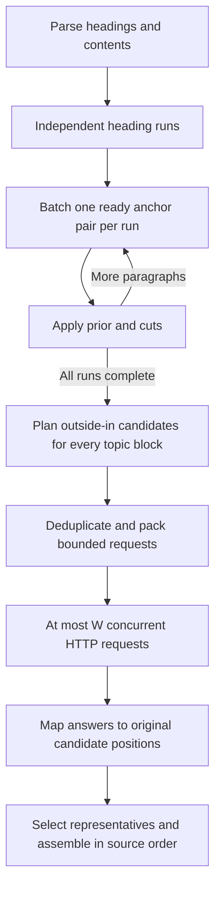

# Parallel processing optimization

Optional `--sentence-stop-threshold 0.90` changes representative scheduling: dispatch one outside-in depth across all active targets, retire targets that reach the threshold, then schedule the next depth. A target stopping does not stop its section/paragraph peers. Already dispatched work is counted. The default remains coalescing across all depths. Early stopping can reduce decisions while adding sequential rounds; [measure both quality and usage](../evals/THRESHOLD_SEARCH.md).

The method now exposes independent decision work at three levels: heading runs, representative candidates, and HTTP batches. It retains the fixed-anchor boundary rule and exact source-backed tree. No new model, embedding service or runtime dependency is required.

## Dependency model

An anchor comparison can change the next anchor. Within one heading run, we therefore resolve `(anchor, next paragraph)` before scheduling its successor. Comparing every future paragraph speculatively would spend decisions on obsolete anchors after a cut and could increase work toward all-pairs behavior.

Different heading runs are independent. The planner collects the next ready pair from each run into a frontier, scores that frontier in batches, applies its cuts, and advances to the next frontier. Headings and contents remain hard boundaries; they are not scored as paragraph content. Scalar third-party scorers retain sequential comparisons.



Outside-in waves define candidate order, not a dependency between scores. There is no score-based early stop. Once segmentation is complete, every representative question is ready: a candidate's score against its paragraph or section does not depend on another candidate's score. The planner combines these questions across waves and sections, instead of waiting after every outer pair or topic block. A one-sentence target still represents itself without a request.

Each question points to its own sentence and context. Repeated contexts and sentence strings appear once per representative request; identical cached judgments need no new question. Candidate budgets count source positions before this deduplication. Coalescing does not add candidates, truncate text, or change which positions a finite budget visits.

## Bounded concurrent dispatch

`JevScorer` uses the same request scheduler for `score_many`, `representatives`, and `rerank`. It packs contiguous jobs up to both the question-count and serialized-state limits. The packer finds the largest fitting prefix with binary search, avoiding serialization of every intermediate prefix. Payloads are built lazily as request slots become available.

The scheduler submits at most `W = max_concurrency` futures. When a request completes, its slot can take another batch even if an earlier request is still slow. This avoids waiting for results in submission order. Responses are validated and matched by question ID, cached by judgment identity, and returned in original input order. Representative reduction and tree assembly use that order, so network completion order cannot change tie winners, source offsets or node IDs for fixed scores.

| Control | Default | Meaning |
| --- | ---: | --- |
| `batch_size` / `--batch-size` | 64 | Maximum questions in one request |
| `max_concurrency` / `--max-concurrency` | 1 | Maximum simultaneous HTTP requests per scorer |
| `max_calls` / `--max-calls` | 1,000 | Total attempted HTTP requests per scorer, including failed attempts |
| `max_state_chars` (Python) | 60,000 | Maximum serialized state characters per request; not a token count or total-body limit |
| `sentence_budget` / `--sentence-budget` | `None` / `0` | All candidates; an integer of at least 2 limits each target |

```python
from zero_index import JevScorer, build_index

jev = JevScorer(
    provider="typesafe",
    batch_size=64,
    max_concurrency=4,
    max_calls=100,
)
index = build_index(source_text, scorer=jev)
print(index.metadata["provider"]["peak_in_flight"])
```

Batching and concurrency are different controls. Increasing concurrency only helps when more than one batch is ready. Increasing batch size can reduce HTTP overhead and repeated context transmission, but can also change provider latency or returned scores. Account quotas and actual request sizes constrain useful settings; no universal optimal worker count is claimed. The default preserves one in-flight request, while four workers are an explicit example configuration.

Threads overlap network I/O. Local lexical/embedding centrality is not made CPU-parallel by this change. Reuse a scorer sequentially to share its cache and total call budget; concurrent public method calls from application threads are not a supported deduplication contract. The internal dispatcher owns concurrency. Separate scorer instances have separate limits, so an application dispatching multiple documents must impose its own aggregate provider budget.

## Failure handling and observability

Call-budget reservation and counters are protected by a lock. Workers cannot collectively exceed `max_calls`. A semaphore also bounds simultaneous requests. A provider error, malformed response, or oversized single context raises visibly; no lexical fallback or truncated context is substituted.

A failed response contributes no partial answers to the cache. Previously consumed, completely validated batches may remain cached. On an observed failure, the scheduler stops submitting new work, cancels work that has not started, and waits for already-running requests to finish before raising. In-flight requests may still incur usage and count as attempts. Automatic retries are not implemented. The CLI writes the index only after the whole build succeeds.

Provider metadata includes the configured concurrency, observed `peak_in_flight`, request numbers, question counts, durations, status, reported token usage, and returned model IDs. Timing and request-start ordering are operational observations, not deterministic tree fields. Sum of request durations is not wall time when requests overlap.

## Work, latency and remaining limits

For a heading run with `n` paragraphs, segmentation still makes `n-1` decisions. Across runs of lengths `n_h`, the frontier depth is `max_h(n_h-1)` rather than the sum of all run lengths. A frontier can require several requests when size limits split it; the current implementation waits for the complete frontier before advancing any run.

For `Q` distinct uncached representative questions and a count limit `K`, the lower bound on requests is `ceil(Q/K)`; state-size limits may increase that number. With `M` equally slow requests, `W` workers and request latency `L`, the network-only estimate is `ceil(M/W) * L`. Serialization, uneven latency, provider queuing and throttling add overhead. These equations describe scheduling, not measured provider throughput.

The current build finishes all topic segmentation before representative scoring. It does not yet pipeline completed sections with unfinished heading runs, batch across separate documents, or stream an arbitrarily large document through bounded planner memory. Planned jobs, contexts and cache entries remain in memory; only submitted futures and materialized request payloads are bounded by concurrency. Within one heading-free document, anchor decisions remain serial. These limits identify further opportunities without claiming that all work can be parallelized.

## Reproducible offline benchmark

```sh
python -m scripts.benchmark_parallel --output output/parallel-benchmark.json
python -m unittest discover -s tests -v
```

The benchmark verifies the original hashes of the frozen pilot implementation and imports it under a separate package name. A synthetic transport replaces HTTP for both implementations: no API key, network call or paid request is used. Stable scores depend on the exact paragraph pair or sentence/context pair. They deliberately create topic cuts so anchor resets are exercised. The harness requires exact equality of trees (including representative scores, visited candidates, spans and IDs) and boundary traces across all runs.

Recorded configuration: Windows, Python 3.12.14, eight headings, four paragraphs per heading, eight sentences per paragraph, two topic blocks per heading, batch size 64, and a fixed 40 ms simulated delay per request. Values below are medians of three runs, without a separate warm-up. The raw file includes every run and runtime source hashes.

| Implementation | Requests | Questions | Peak in flight | Median time | Speedup vs legacy |
| --- | ---: | ---: | ---: | ---: | ---: |
| Archived section/wave scheduling, serial | 88 | 536 | 1 | 3.592 s | 1.0× |
| Coalesced planning, serial transport | 11 | 536 | 1 | 0.456 s | 7.9× |
| Coalesced planning, four concurrent requests | 11 | 536 | 4 | 0.213 s | 16.9× |

Here 24 boundary questions pack into three frontier requests; 512 representative questions pack into eight requests. Coalescing alone removes 77 requests (87.5%); concurrency then overlaps the eight representative requests. This separates gains from fuller batches and gains from overlapping I/O. [Raw results](../evals/results/parallel-synthetic-v1.json).

**These are synthetic scheduling results.** They do not establish live Jev latency, token savings, evidence recall or answer quality. Fixed-score equality establishes preservation of the decision procedure, not invariance of the provider's scores under different shared state. The [existing pilot](../evals/REPORT.md) already records differences between serial and batched probabilities. Evaluate request composition and worker count on matched live inputs before making a provider-performance claim. Frozen pilot and SciFact artifacts have not been rewritten.

The state/question/answer format follows the [TypeSafe API reference](https://docs.typesafe.ai/api), which returns named answers for named questions. This implementation adds client-side scheduling; its concurrency setting is not a documented provider maximum.
