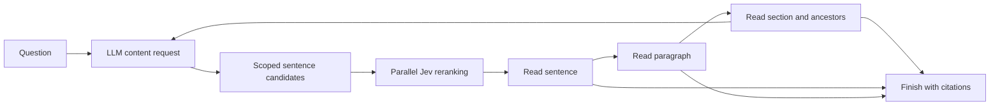

# Existing leaf-first retrieval API

The new research direction uses [root-to-leaf tree search and an independent dense retrieval path](tree-system.md). This page documents the existing `retrieve()` API for compatibility.

The retrieval LLM describes the content it needs. Jev scores candidate evidence for relevance. The LLM reads selected sentences, then requests their paragraphs and ancestors when it needs more context.



## Callback contract

```python
from zero_index import JevScorer, retrieve

def choose(state):
    # Your application supplies the model call and parses its JSON response.
    return call_your_model(state)

result = retrieve(
    index, "When can visitors enter and leave?", choose,
    reranker=JevScorer(), candidate_limit=64, top_k=5,
)
```

The callback receives the original question, structural outline, tool history, and remaining steps. Without an explicit reranker, the labeled offline lexical baseline is used; no hidden API call occurs.

| Action | Example | Behavior |
| --- | --- | --- |
| Propose content | `{"action":"find","need":"visitor opening and closing times"}` | Find candidate leaves and rerank them |
| Restrict search | `{"action":"find","need":"weather exceptions","scope_id":"n000012"}` | Search under a known node or resolved TOC entry |
| Read evidence | `{"action":"read","node_id":"n000009"}` | Read a sentence returned by a previous search |
| Expand context | `{"action":"up","node_id":"n000009"}` | Read the immediate parent of an already read node |
| Finish | `{"action":"finish","node_ids":["n000008"]}` | Return only nodes actually read |

IDs above are illustrative; use actual IDs returned by the outline and search. The LLM can propose another need at any point. An empty finish means insufficient evidence. It cannot cite a ranking preview, jump directly to an unread chapter, or skip a parent with `up`.

The proposal describes desired information, not an assumed answer. Ask for “the observed operating margin and its reporting year,” rather than inventing a value. Jev receives both the original question and the proposal; contrary evidence is explicitly relevant.

## Candidates and reranking

Each candidate contains exact sentence text, its heading path, its paragraph representative, and source offsets. Contents entries are navigation, not evidence candidates.

A BM25-style first pass combines the original question and proposed need, scoring sentence text plus heading and paragraph context. It scans scoped leaves and keeps up to `candidate_limit`; it uses no embeddings and is not yet a persisted inverted index.

Jev then asks a separate `noul` relevance question for every candidate. This differs from same-topic and representativeness judgments. Independent questions share query context and run in parallel inside a request. Multiple requests can overlap with `JevScorer(max_concurrency=4)` or `find --max-concurrency 4`; the default is 1. Responses are mapped by question ID and restored to candidate order; incomplete responses fail without caching partial results. See [parallel processing](parallel-processing.md) for shared budgets and failure handling.

Jev scores set the final order; lexical scores and source order break ties. Retrieval relevance does not use the topic-segmentation prior. The offline baseline's scores are relative lexical scores, not probabilities.

A lexical shortlist can omit a relevant paraphrase. Results expose pool size, candidate count, filtering, and lexical-overlap status. Set `candidate_limit=None` (CLI `--candidates 0`) to rerank every leaf in the scope. Both scope selection and shortlisting affect recall.

## Reading limits and evidence

The path is `sentence → paragraph → topic section → heading → ancestor headings → document`. A node exceeding per-read or cumulative character limits produces a budget event; it is neither truncated nor admitted as evidence. The LLM can finish with smaller evidence or search elsewhere.

Defaults: 16 actions, 64 candidates/search, 5 displayed matches, 256 cumulative reranked candidates, 12,000 characters/read, and 48,000 cumulative read characters. Repeated reads of the same node are free against the read budget; overlapping different nodes count again. Final evidence drops a child when its selected parent already covers it.

These are application limits, not context-window guarantees. The caller must also budget for the outline, previews, and history. Answer generation remains the caller's responsibility.

## Run the protocol

```sh
python -m examples.bottom_up
python -m zero_index build examples/structured.md -o output/structured.index.json
python -m zero_index outline output/structured.index.json
python -m zero_index find output/structured.index.json "when visitors enter and gates close"
python -m zero_index parent output/structured.index.json NODE_ID
```

The example uses a scripted callback and lexical ranking; it demonstrates control flow, not live model quality. Set `OPENROUTER_API_KEY` and add `--reranker jev` to a CLI search to use Jev.

The original unrestricted `children/read/finish` loop is retained as `navigate()`. Existing callers of the old `retrieve()` contract should switch to `navigate()` or adopt the new actions. Saved v1 indexes remain loadable; new output uses schema v2 for structural metadata.

