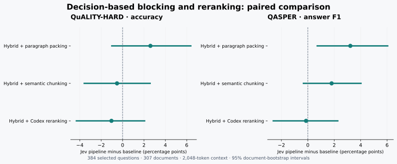

# A 384-question comparison of decision-based blocking and RAG pipelines

**Run completed 2026-10-05.** Jev produced answer scores close to the Codex-reranked baseline, with lower QASPER evidence recall. This study does **not establish superiority over the strongest baseline**. The prior and sudden-drop cut rule were evaluated together as the blocking method, with no separate prior ablation.

All **1,536 predictions** are present: four pipelines on 192 QuALITY development HARD questions and 192 QASPER test questions, across **307 independent source documents**. There were no invalid or missing predictions. Selection, prompts, settings and code hashes were [committed before inference](https://github.com/Sheltercosmo/0halluciation-drift-indexing/commit/2fc8f3d4de82f330732ef8219eeb6077a5ae9c9f). See the [registered protocol](BOUNDED_PROTOCOL.md), [selection](results/bounded-v1/selection.json) and [data attribution](bounded/DATA_SOURCES.md).

## Answer and evidence quality

All scores below use a 0–100 scale. Higher is better.

| Pipeline | QuALITY-HARD accuracy | QASPER answer F1 | Retrieved-context evidence F1 | Evidence recall | Complete evidence recovery |
| --- | ---: | ---: | ---: | ---: | ---: |
| Hybrid + paragraph packing | 86.98 | 46.42 | 16.60 | 82.69 | 70.29 |
| Hybrid + semantic chunking | 90.10 | 47.83 | 17.04 | 84.96 | 73.71 |
| Hybrid + Codex reranking | **90.63** | **49.77** | 18.42 | **88.71** | **78.29** |
| **Jev blocking + reranking** | **89.58** | **49.63** | **19.24** | **84.60** | **73.71** |

Answer metrics include all 192 questions per dataset. Evidence F1 includes all 192 QASPER questions and uses the official paragraph scorer over fully retrieved source paragraphs. It is **retrieved-context F1**, not evidence explicitly selected by the reader. Recall and complete recovery cover the **175 questions with a nonempty reference evidence set**, taking the best valid annotation separately. Unanswerable cases are retained in answer scoring.

Jev answered 172/192 QuALITY-HARD questions correctly; paragraph packing answered 167, semantic chunking 173, and Codex reranking 174. On QASPER, Jev's answer F1 was 3.22 points above paragraph packing and 0.13 below Codex reranking. Its highest retrieved-context F1 coexisted with lower recall than Codex reranking: precision and coverage should not be conflated.

## Paired uncertainty

Differences below are **Jev minus baseline**, in points on the 0–100 scale, with 95% intervals from 10,000 bootstrap samples of whole source documents.

| Baseline | QuALITY-HARD accuracy difference | QASPER answer F1 difference | QASPER evidence recall difference |
| --- | ---: | ---: | ---: |
| Paragraph packing | +2.60 [−1.01, +6.38] | +3.22 [+0.71, +6.05] | +1.90 [−0.91, +4.98] |
| Semantic chunking | −0.52 [−3.59, +2.58] | +1.80 [−0.33, +4.03] | −0.36 [−2.76, +2.11] |
| Codex reranking | −1.04 [−4.32, +2.06] | −0.13 [−2.62, +2.27] | −4.11 [−7.06, −1.42] |

The answer-score intervals against Codex reranking include both gains and losses; this is not evidence of equivalence. QASPER's descriptive interval against paragraph packing is positive, while evidence recall is lower than Codex reranking. These intervals are not corrected for multiple comparisons and describe this single run.

The QASPER sample deliberately emphasizes multiple evidence passages: 160 such questions, 16 single/zero-evidence answerable questions, and 16 unanimously unanswerable questions. On the 160-question slice, answer F1 was 44.24 / 45.12 / 46.86 / 47.75 for paragraph packing / semantic chunking / Codex reranking / Jev. On the 16 unanswerable questions, correct abstentions were 11 / 13 / 14 / 12. These small slices are descriptive.

## Controls and scope

Every pipeline received identical source parsing, native titles/headings, BM25+dense RRF retrieval, multiple-choice options where applicable, and the same Codex reader prompt. The source reading limit was **2,048 cl100k_base tokens**, including wrappers and headings; all chunks were capped at 512 tokens without overlap. Indexing received no evaluation questions or gold labels.

| Pipeline | Mean QuALITY context tokens | Mean QASPER context tokens | Indexed chunks |
| --- | ---: | ---: | ---: |
| Paragraph packing | 1,921 | 1,991 | 5,237 |
| Semantic chunking | 2,018 | 2,014 | 7,932 |
| Codex reranking | 1,909 | 1,963 | 5,237, shared with paragraph packing |
| Jev blocking + reranking | 1,969 | 1,893 | 10,555 |

All **24,176 parsed paragraphs** were covered in each index; every chunk was verified against its exact parsed-source span and the size limit. This is an implementation integrity result, not a semantic-boundary accuracy score.

The combined Jev arm changes both blocking and reranking, and produces a different chunk-size distribution. This study compares pipelines; it does not isolate either component's causal contribution. Retrieval embeddings are enabled. Full tree traversal, representative selection, query proposals, the embedding-free path, and actual RAPTOR/PageIndex/HiChunk adapters are outside this run. QASPER uses text and captions, without figure/table images. These selected subsets are not full-benchmark or leaderboard results. Batching and a single reader draw also limit conclusions about model variability.

## Usage and budget

Models were native TypeSafe **jev-1.13.0**, **gemini-embedding-2** at 768 dimensions, and Codex **gpt-6.1-sol** with low reasoning effort. The [runtime record](results/bounded-v1/runtime.json) pins the CLI binary and Python dependencies.

| Stage | Calls | Reported input tokens | Reported output tokens |
| --- | ---: | ---: | ---: |
| Jev blocking | 8,456 | 9,890,705 | 875,953 |
| Jev reranking | 384 | 2,104,691 | 78,137 |
| Codex reranking | 96 | 3,262,506 | 22,533 |
| Codex reader | 194 | 6,311,799 | 70,137 |
| Gemini embeddings, all stages | 1,836 attempts | 5,692,722 on successful responses | — |

Seven embedding attempts were retried successfully and remain in the budget ledger. No Jev or Codex call failed, and no Codex call used tools. There were 196 reader batch jobs; two exact-input cache hits avoided model calls. Codex input totals include 2,776,576 cached tokens; reasoning tokens are a subset of output tokens.

At the [verified embedding price](https://ai.google.dev/gemini-api/docs/pricing) of $0.20 per million input tokens, successful Gemini responses imply **$1.14** for this run. The conservative reservation, including retry attempts and token buffers, is **$1.41**. Adding the **$4 reserve for earlier work** gives **$5.41 against the user's $30 cap**. These are usage-based estimates and reservations, not an invoice. No Gemini generation was used. Codex consumed the existing account allowance; Jev dollar charges are not returned by its responses.

Blocking requested 49,537 decisions, of which 21,032 were consumed in sequential cut decisions; the remainder were prefetched past cuts. They are included in usage. Latencies in the [audit summaries](results/bounded-v1/provenance.json) include different interfaces and batching; they do not establish a general model speedup. Tokenizer preflight calls are excluded from the embedding-attempt count.

## Reproduce scores without paying for model calls

Use Python 3.11+; the recorded run used Python 3.12.14. Download only the two benchmark files, reconstruct the frozen inputs, and check all archived predictions:

~~~sh
python -m pip install -r evals/requirements-bounded.txt
python scripts/fetch_bounded_data.py
python evals/results/bounded-v1/source/scripts/bounded_eval.py prepare --data output/frontier-data --output output/bounded-replay
python scripts/replay_bounded_results.py
~~~

Local replay passed for **all 1,536 predictions**, official answer/evidence scores, source contexts, token limits and paired bootstrap intervals, with **zero model calls**. [Predictions and per-question scores](results/bounded-v1/scores.json), [aggregate results](results/bounded-v1/summary.json), [frozen source](results/bounded-v1/source), and sanitized [Jev](results/bounded-v1/jev-audit.json), [Codex](results/bounded-v1/codex-audit.json) and [embedding](results/bounded-v1/embedding-audit.json) request metadata are published.
