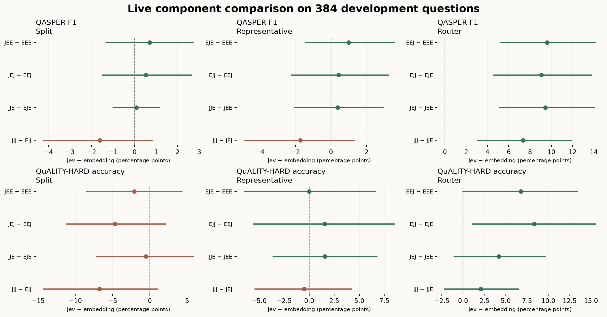

# Live central-sentence, tree-search and complete-system comparison

**Complete:** 7,680 scored method/question records across 384 exposed development questions and 307 documents. QASPER and QuALITY-HARD each contribute 192 questions. Validation and test remain unopened.

All arms use the same Gemini 2.5 Flash planner and reader (temperature 0, thinking disabled), Gemini Embedding 2 at 768 dimensions where applicable, and Jev 1.13.0 for decision-based stages. One isolated answer is reused for identical reader inputs. Final source contexts are capped at 2,048 cl100k tokens. The original sixteen-arm study contributes 6,144 records; two frozen follow-ups add 768 records each, comparing both embedding and Jev systems at each iteration.

These are exploratory development measurements of a restricted implementation. The baselines are generic dense, BM25+dense and generative-reranking pipelines, not reproductions of established competing systems. RAPTOR, ColBERTv2, BGE-M3 and Qwen3 retrieval/reranking were not evaluated. This run does not establish frontier performance or validate the intended top-3, confidence-pruned retrieval policy.

Evidence-paragraph retrieval is the primary indexing outcome. QASPER answer F1 and QuALITY accuracy measure a separate downstream reader and are secondary diagnostics. The reader is Gemini 2.5 Flash, an older model; results do not establish performance with current readers.

## Complete systems and all factorial arms

`E` means embedding and `J` means Jev. The three positions are **split / representative / router**. For example, `EJE` uses embedding splits, Jev central sentences and embedding tree search. Every tree arm uses the same native headings and source paragraph offsets.

| Method | QASPER evidence recall | QASPER answer F1 (secondary) | QuALITY-HARD accuracy (secondary) |
| --- | ---: | ---: | ---: |
| EEE | 33.55% | 33.37 | 43.75% |
| EEJ | 53.76% | 42.99 | 50.52% |
| EJE | 34.69% | 34.36 | 43.75% |
| EJJ | 54.12% | 43.43 | 52.08% |
| JEE | 32.67% | 34.07 | 41.67% |
| JEJ | 53.32% | 43.52 | 45.83% |
| JJE | 33.00% | 34.44 | 43.23% |
| JJJ | 54.68% | 41.80 | 45.31% |
| Direct dense, recursive chunks | 86.03% | 42.60 | 70.83% |
| BM25 + dense, recursive chunks | 83.82% | 44.72 | 70.83% |
| Generative reranking, recursive chunks | 89.98% | 44.99 | 73.44% |
| Direct dense, semantic chunks | 86.14% | 44.93 | 68.75% |
| BM25 + dense, semantic chunks | 85.51% | 46.88 | 69.79% |
| Generative reranking, semantic chunks | 89.95% | 44.31 | 72.92% |
| Jev tree + direct dense, full budgets | 86.61% | 42.22 | 70.31% |
| Jev tree + direct dense, divided budget | 86.32% | 42.56 | 70.83% |
| Embedding tree, retry + bottom-up reading | 51.11% | 38.35 | 52.08% |
| Jev tree, retry + bottom-up reading | 70.90% | 48.14 | 54.17% |
| Embedding tree, successive ancestor expansion | 76.04% | 45.46 | 61.98% |
| Jev tree, successive ancestor expansion | 81.88% | 42.54 | 63.02% |

Evidence recall is averaged over 175 questions with annotated evidence and uses source paragraphs fully present in the final context. Representative sentences and unselected previews are not counted as retrieved evidence. No subjective central-sentence gold labels were invented.

There are 40 explicit reader failure records across 2 questions. They receive zero answer score in the table above. Provider-blocked inputs are terminal and are not retried or sent to another model. The common-unblocked fields in the [summary](results/live-tree-complete-v2/summary.json) restrict all methods to the same questions without any reader block; matching paired intervals are included in the interval file. The forty records include skipped calls for the two questions already blocked in the original study.

## Controlled component effects

Each row changes exactly one component from embedding to Jev. Values are percentage-point differences with descriptive 95% paired document-bootstrap intervals (10,000 replicates). They are not multiplicity-adjusted confirmatory tests.

| Changed component | Jev arm − embedding arm | QASPER F1 difference [95% interval] | QuALITY accuracy difference [95% interval] |
| --- | --- | ---: | ---: |
| split | JEE − EEE | +0.70 [-1.33, +2.75] | -2.08 [-8.51, +4.28] |
| split | JEJ − EEJ | +0.53 [-1.49, +2.65] | -4.69 [-11.11, +2.07] |
| split | JJE − EJE | +0.08 [-0.99, +1.15] | -0.52 [-7.14, +5.88] |
| split | JJJ − EJJ | -1.62 [-4.24, +0.80] | -6.77 [-14.29, +1.02] |
| representative | EJE − EEE | +0.99 [-1.42, +3.57] | +0.00 [-6.49, +6.60] |
| representative | EJJ − EEJ | +0.44 [-2.23, +3.23] | +1.56 [-5.53, +8.51] |
| representative | JJE − JEE | +0.38 [-2.03, +2.93] | +1.56 [-3.61, +6.74] |
| representative | JJJ − JEJ | -1.72 [-4.89, +1.31] | -0.52 [-5.41, +4.23] |
| router | EEJ − EEE | +9.62 [+5.24, +14.13] | +6.77 [+0.00, +13.37] |
| router | EJJ − EJE | +9.06 [+4.57, +13.78] | +8.33 [+1.06, +15.50] |
| router | JEJ − JEE | +9.45 [+5.13, +14.06] | +4.17 [-1.06, +9.60] |
| router | JJJ − JJE | +7.36 [+3.03, +11.88] | +2.08 [-2.13, +6.52] |



## Failure-driven iteration: retry and bottom-up reading

The primary Jev tree supplied only 297 context tokens on average for QASPER, and exhausted its search budget with an empty context on 109 of 192 QuALITY questions. Searching several proposed needs consumed the budget before a sentence leaf was reached. Direct methods used about 2,000 context tokens.

The follow-up was frozen from those retrieval diagnostics. For both embedding and Jev trees, exhausted searches retry using the first shared need. Reached paragraphs are then read first, followed by topic parents and nearby paragraphs inside the same topics, all under the original final context limit. This allows at most two search attempts and therefore uses extra routing compute. Both variants are reported regardless of outcome.

| Follow-up contrast | QASPER F1 difference [95% interval] | QuALITY accuracy difference [95% interval] |
| --- | ---: | ---: |
| EEE_bottom_up − EEE | +4.98 [+2.72, +7.47] | +8.33 [+1.59, +15.38] |
| JJJ_bottom_up − JJJ | +6.33 [+3.05, +9.86] | +8.85 [+2.23, +15.43] |
| JJJ_bottom_up − EEE_bottom_up | +9.79 [+5.60, +14.15] | +2.08 [-5.82, +10.00] |
| JJJ_bottom_up − rerank_recursive | +3.15 [-1.23, +7.64] | -19.27 [-25.68, -12.90] |
| JJJ_bottom_up − rerank_semantic | +3.83 [-0.31, +8.19] | -18.75 [-25.95, -11.64] |
| JJJ_bottom_up − hybrid_full | +5.92 [+1.63, +10.26] | -16.15 [-22.75, -9.80] |
| JJJ_bottom_up − rrf_semantic | +1.26 [-3.14, +5.66] | -15.62 [-22.51, -8.85] |

The first repair still averaged only 678 Jev context tokens for QASPER. A second policy was frozen from those context-length diagnostics before inspecting first-follow-up QA aggregates. It reuses the exact same routes, preserves previously selected evidence, then interleaves nearby paragraphs through topic, heading and document ancestors. It makes no additional routing or embedding calls. The reader sees one final source context; this is deterministic ancestor expansion, not interactive LLM traversal.

| Second-iteration contrast | QASPER F1 difference [95% interval] | QuALITY accuracy difference [95% interval] |
| --- | ---: | ---: |
| EEE_ancestor − EEE_bottom_up | +7.10 [+2.59, +11.74] | +9.90 [+3.74, +16.04] |
| JJJ_ancestor − JJJ_bottom_up | -5.60 [-9.80, -1.72] | +8.85 [+2.75, +15.03] |
| JJJ_ancestor − JJJ | +0.73 [-4.17, +5.46] | +17.71 [+9.69, +25.76] |
| JJJ_ancestor − EEE_ancestor | -2.92 [-6.61, +0.53] | +1.04 [-5.29, +7.25] |
| JJJ_ancestor − hybrid_full | +0.32 [-3.30, +3.85] | -7.29 [-13.33, -1.52] |
| JJJ_ancestor − dense_recursive | -0.07 [-3.82, +3.51] | -7.81 [-13.92, -2.00] |
| JJJ_ancestor − rrf_recursive | -2.19 [-6.61, +2.18] | -7.81 [-13.92, -1.99] |
| JJJ_ancestor − rerank_recursive | -2.45 [-6.25, +1.25] | -10.42 [-16.85, -4.19] |
| JJJ_ancestor − dense_semantic | -2.39 [-6.40, +1.36] | -5.73 [-12.31, +0.53] |
| JJJ_ancestor − rrf_semantic | -4.34 [-8.43, -0.55] | -6.77 [-12.82, -1.01] |
| JJJ_ancestor − rerank_semantic | -1.77 [-5.39, +1.74] | -9.90 [-15.87, -4.08] |

| Tree | QASPER mean context tokens | QuALITY empty contexts |
| --- | ---: | ---: |
| EEE | 273.7 | 57 / 192 |
| JJJ | 297.4 | 109 / 192 |
| EEE_bottom_up | 630.7 | 4 / 192 |
| JJJ_bottom_up | 678.3 | 5 / 192 |
| EEE_ancestor | 2024.2 | 4 / 192 |
| JJJ_ancestor | 2023.3 | 5 / 192 |

## Retrieval and compute controls

- Representatives search the same outside-in sequence, with at most eight candidates per node. The optional 0.9 early stop is disabled for this comparison.
- At topic and paragraph nodes, both routers see one fixed central sentence plus the heading path. The representative-selection method and router are independently varied. Headings supply titles; sentence leaves supply their own source text.
- Tree search starts at the root and visits headings, topic blocks, paragraphs and sentence leaves. Each shared need keeps the best two candidates across each layer. Confidence pruning is disabled. Each query allows at most 256 node scores and 8,192 cumulative preview-payload tokens, including repeated request and metadata fields.
- The cumulative allowance is an experiment guard, not a model context-window limit. A whole round that would exceed it is rejected; a search stopped before any sentence leaf returns no evidence. These constraints differ from top-3 confidence-pruned paragraph retrieval.
- Sentence leaves are scored against the query, so their selection is query-dependent. The primary reader nevertheless receives their parent paragraphs. Returning only selected evidence sentences was not evaluated. All methods use the same source-union renderer and final token limit.
- Flat methods search the whole document independently. Multiple shared needs combine through RRF with constant 60; the reranker receives at most 8,192 source tokens.
- The full-budget hybrid combines 8,192 tree-preview tokens with 8,192 direct-passage tokens. The divided-budget hybrid gives each path 4,096 tokens. Both fuse whole-path outputs with equal-weight RRF; neither mixes routing scores.
- Query-time previews and flat source pools contain different information even at equal token ceilings. The generative reranker sees full globally retrieved candidate passages; it is not a same-input comparison against Jev reranking. Summed cached API time is not standalone system latency.

## Reproducibility and limitations

All 614 native-to-topic topologies were checked against the original recursive packing of the cached Jev and embedding split groups. Metadata and transport repairs are recorded in the manifest amendments; no answer outcomes were inspected to choose those repairs. The provider input quota required paced embeddings.

The generative reranker needed deterministic permutation normalization on 24 responses. The adapter takes the earliest usable reply, keeps its first-occurrence priorities and appends omitted candidates in original RRF order. This policy was applied uniformly before reader inference. [Raw and normalized orders](results/live-tree-complete-v2/ranker-normalizations.json) remain available.

The reader adapter repaired 6 copied-ID typos by attaching the canonical identity of the single isolated request. Answer text was not edited, and the earliest usable reply is selected uniformly. [Identity-repair audit](results/live-tree-complete-v2/reader-identity-normalizations.json).

**Reader contract correction:** the first mixed-task reader frequently answered multiple-choice questions with free text or “Unanswerable,” making strict A–D accuracy misleading. All sixteen QuALITY arms were rerun uniformly with explicitly labelled options and an A–D enum response schema; no labels were inferred from gold. Original QASPER answers and every retrieval context were preserved. Known provider-blocked questions were not sent again. The follow-up uses the same corrected reader. [Original outputs](results/live-tree-v1/scores.json) and the [contract audit](results/live-tree-complete-v2/reader-contract-audit.json) are retained.

The sample is deliberately difficult and evidence-dense, but already exposed. It does not represent a complete benchmark, multi-reader replication, open-corpus retrieval, image reasoning, or a published RAPTOR/PageIndex comparison. All registered arms, including regressions and exhausted routes, remain in the denominators.

[All predictions and source spans](results/live-tree-complete-v2/scores.json) · [Paired intervals](results/live-tree-complete-v2/paired-intervals.json) · [Routing diagnostics](results/live-tree-complete-v2/routing-analysis.json) · [Failure comparisons](results/live-tree-complete-v2/failure-comparisons.json) · [Usage](results/live-tree-complete-v2/usage.json) · [Registration](results/live-tree-complete-v2/manifest.json)

## Replay

Reconstruct the original bounded inputs as described in [the data protocol](BOUNDED_PROTOCOL.md), then verify this report without provider credentials:

```sh
python scripts/export_live_tree_complete.py replay
```

The replay checks frozen source and official-data hashes, all 7,680 predictions, source context hashes, token limits, official answer/evidence metrics, aggregates and paired intervals.
