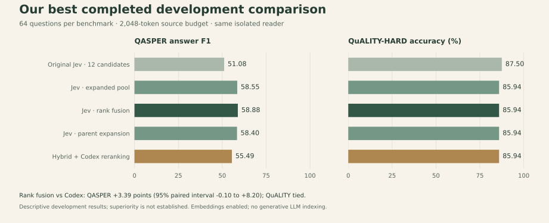

# Best completed performance

This page preserves the earlier flat-reranking development snapshot. It does not measure the new central-sentence, root-to-leaf search or independent-path hybrid design. The [current research protocol](TREE_SYSTEM_PROTOCOL.md) now directs the comparison; no new-system scores are claimed here.

**Updated 2026-10-05.** The highest completed Jev QASPER answer score is **58.88 F1** on 64 development questions. The larger, separate study reached **89.58% QuALITY-HARD accuracy** on 192 questions. These are different configurations and samples. Neither is a full-benchmark or held-out result.

The method combines decision-model topic blocking with a statistical probability-drop cut rule. Jev indexing uses zero generative LLM calls. These comparisons enable retrieval embeddings and use a query-time Codex reader.

## Best QASPER configuration and matched comparison



The five-method comparison is complete: **640 predictions on 128 questions**, with **zero failed final predictions**. It uses 64 QASPER questions from 64 papers and 64 QuALITY-HARD questions from 55 stories. Each method receives the same questions and a **2,048-token final source budget**, including titles and headings.

| Configuration | QASPER answer F1 | QASPER evidence recall | QuALITY-HARD accuracy |
| --- | ---: | ---: | ---: |
| Original Jev, 12 candidates | 51.08 | 82.18% | **87.50%** |
| Jev, expanded candidate pool | 58.55 | 90.56% | 85.94% |
| **Jev, rank fusion** | **58.88** | **90.56%** | 85.94% |
| Jev, topic-parent expansion | 58.40 | 90.56% | 85.94% |
| Hybrid + Codex reranking, expanded pool | 55.49 | **91.35%** | 85.94% |

Evidence recall covers the 58 QASPER questions with nonempty reference evidence; answer metrics cover all 64. Expanded methods receive an 8,192-token candidate pool. Rank fusion is the best observed QASPER configuration, rather than a winner across every metric. The default implementation has not been changed on the basis of this screen.

The reader is `gpt-6.1-sol` with low reasoning effort, one question per call and one reader draw per distinct input. Identical case/query/context inputs share the same prediction across methods: 488 unique inputs produce the 640 method predictions. This removes cross-question reader batching and avoids comparing different reader samples for identical contexts. It does not eliminate reader variance.

| Paired comparison | Difference, points | Descriptive 95% interval |
| --- | ---: | ---: |
| Rank fusion vs expanded Codex, QASPER answer F1 | +3.39 | −0.10 to +8.20 |
| Rank fusion vs expanded Codex, QuALITY accuracy | 0.00 | −6.06 to +6.35 |
| Expanded Jev vs original Jev, QASPER answer F1 | +7.46 | +1.79 to +14.18 |
| Expanded Jev vs original Jev, evidence recall | +8.37 | +3.08 to +14.78 |
| Expanded Jev vs original Jev, QuALITY accuracy | −1.56 | −8.33 to +5.00 |

Intervals use 10,000 paired bootstrap samples of whole source documents and are not adjusted for multiple comparisons. The QASPER interval against expanded Codex includes zero, and QuALITY is tied. **Superiority over the strongest baseline is not established.** Repeated development comparisons also make these results unsuitable for a confirmatory claim.

[Registered reader protocol](iterations/v1/isolated-reader-manifest.json) · [Candidate-pool protocol](iterations/v1/REPORT.md) · [All predictions](results/isolated-reader-v1/scores.json) · [Summary](results/isolated-reader-v1/summary.json) · [Paired intervals](results/isolated-reader-v1/paired-intervals.json) · [Audit](results/isolated-reader-v1/analysis.json) · [Failure comparisons](results/isolated-reader-v1/failure-comparisons.json) · [Frozen source](results/isolated-reader-v1/source)

## Larger completed comparison

The earlier study contains **1,536 predictions**, with four pipelines on 192 questions per benchmark across 307 documents. It evaluates the original Jev configuration; those documents are now exposed development material. Its batched reader and different question sample mean its scores should not be treated as a before/after comparison with the isolated-reader screen.

| Pipeline | QASPER answer F1, 192 questions | QuALITY-HARD accuracy, 192 questions |
| --- | ---: | ---: |
| Hybrid + paragraph packing | 46.42 | 86.98% |
| Hybrid + semantic chunking | 47.83 | 90.10% |
| Hybrid + Codex reranking | **49.77** | **90.63%** |
| Jev blocking + reranking | 49.63 | 89.58% |

Jev answered **172/192** QuALITY-HARD questions correctly, compared with **174/192** for Codex reranking. Jev's answer-score intervals against that baseline include zero; its QASPER evidence recall was lower. [Full report, paired intervals, usage and replay instructions](BOUNDED_REPORT.md).

## Reproduce the completed results

The commands below download public benchmark data and replay archived predictions, source spans, rendered token budgets and official scores. They make **no model calls**.

```sh
python -m pip install -r evals/requirements-bounded.txt
python scripts/fetch_bounded_data.py
python evals/results/bounded-v1/source/scripts/bounded_eval.py prepare --data output/frontier-data --output output/bounded-replay
python scripts/replay_bounded_results.py
python scripts/replay_development_results.py --data output/bounded-replay --results evals/results/isolated-reader-v1
```

The figure is generated directly from the published result JSON by `python scripts/plot_development_results.py` (requires Matplotlib).

## What remains to establish frontier performance

The [document-disjoint protocol](ITERATION_PROTOCOL.md) reserves **1,425 validation questions and 1,559 test questions**. Both remain unopened. The earlier [shared-planner flat-reranking experiment](iterations/v1/PLANNED_EVIDENCE_PROTOCOL.md) stopped after a reader timeout with 128 plans, 128 retrievals and 28 of 256 reader outputs. It has no aggregate result and will not be resumed as the main direction. Its partial outputs are preserved. A published RAPTOR adapter has been verified offline, but a measured live comparison is still pending. No claim of superiority over RAPTOR or PageIndex is supported yet.

The research goal remains active: broaden development comparisons, freeze candidates before validation, then evaluate the selected method once on the untouched test partition. The best development score is evidence for further work, not a substitute for that test.
