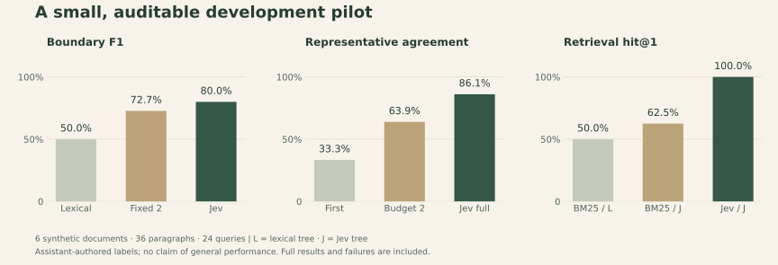

# Pilot v1 · live results

**Jev improved retrieval and representative selection on this small synthetic corpus. Topic segmentation still over-split five same-topic gaps.** These are development results, not proof of general performance, a PageIndex comparison, or an end-to-end LLM answer evaluation.

For a separate check using existing public annotations, see the [SciFact retrieval micro-pilot](SCIFACT_REPORT.md): 11/12 hit@1 for Jev versus 7/12 for BM25-style ranking in supplied five-abstract pools.

The frozen [protocol](PROTOCOL.md), [corpus and gold labels](pilot.json), [full results](results/pilot-v1-live/results.json), [per-request audit](results/pilot-v1-live/decisions.jsonl), and [source manifest](results/pilot-v1-live/manifest.json) are included. There are six original assistant-authored documents, 36 paragraphs, 108 sentences, 30 paragraph gaps with 10 labeled boundaries, and 24 questions. Gold labels were written before the live calls. No thresholds were tuned after seeing outcomes.



## Topic boundaries

Exact paragraph-gap scoring, pooled across documents. Each method follows its own anchor sequence. Fixed-size chunks cut after every two paragraphs. The lexical method uses the same cut policy with its illustrative similarity likelihoods.

| Method | Correct cuts | Extra cuts | Missed cuts | Precision | Recall | F1 |
| --- | ---: | ---: | ---: | ---: | ---: | ---: |
| Headings only | 0 | 0 | 10 | 0.000 | 0.000 | 0.000 |
| Fixed two paragraphs | 8 | 4 | 2 | 0.667 | 0.800 | 0.727 |
| Lexical Jaccard | 10 | 20 | 0 | 0.333 | 1.000 | 0.500 |
| Jev, prior 0.5 | 10 | 6 | 0 | 0.625 | 1.000 | 0.769 |
| **Jev, prior 0.7** | **10** | **5** | **0** | **0.667** | **1.000** | **0.800** |

The stronger prior removed one false cut on this corpus. That does not establish that 0.7 is calibrated or optimal. The extra cuts separated visitor departures, irrigation leak handling, emergency access review, map light protection, and signal restoration from their labeled parent topics. This suggests that the current “same specific topic” rubric sometimes distinguishes subtopics more narrowly than the annotation. That interpretation needs independent labels before changing the policy.

## Paragraph representatives

| Method | Intended sentence selected | Agreement |
| --- | ---: | ---: |
| Lexical pairwise centrality | 7 / 36 | 19.4% |
| First sentence | 12 / 36 | 33.3% |
| Jev, first/last only, budget 2 | 23 / 36 | 63.9% |
| **Jev, exhaustive parallel waves** | **31 / 36** | **86.1%** |

Gold main-point positions were deliberately balanced: 12 first, 12 middle, 12 last. The budget-two ablation reuses the full run's paragraph decisions and cannot see the 12 middle labels; its ceiling is therefore 66.7% here. It is a controlled coverage test, not a natural estimate of where main points occur in documents. As requested, all paragraphs advance together from their edges toward their middles.

All five full-search disagreements selected concrete operational instructions where the gold label preferred a more general summary sentence. Examples include the exact rollback condition instead of the general purpose of rollback, and the fifty-lux limit instead of the general purpose of limiting light. Both choices may be useful; the single-label metric is subjective. All disagreements remain in `documents.json`. Section representatives are archived but have no independent quality labels in this pilot.

## Retrieval and upward reading

Every method searches all 18 sentence leaves in each document. The requested content is exactly the query text; no gold answer, label or oracle rewrite is provided. BM25 here means this repository's **BM25-style** ranking over sentence text plus headings and paragraph representatives, not an optimized external search engine.

| Tree / ranking | Hit@1 | Mean evidence recall@3 | MRR | Evidence recall after top-1 → paragraph |
| --- | ---: | ---: | ---: | ---: |
| Lexical tree / BM25-style | 12 / 24 (50.0%) | 79.2% | 0.689 | 83.3% |
| Jev tree / BM25-style | 15 / 24 (62.5%) | 79.2% | 0.745 | 79.2% |
| **Jev tree / Jev reranking** | **24 / 24 (100%)** | **100%** | **1.000** | **100%** |

The reranker gains 37.5 percentage points in hit@1 over BM25-style ranking on the **same Jev tree**. A paired document-cluster bootstrap gives a descriptive 95% percentile interval of +25.0 to +54.2 points (six clusters, 10,000 resamples, seed 1729). Six authored documents are far too narrow to infer real-world accuracy from that interval.

All 24 Jev-selected paragraph reads had exact source text, offsets and source hashes. They consumed an average of 222.75 characters per query, counting both the sentence and its paragraph. This tests a fixed one-parent expansion policy; it does **not** measure an LLM deciding what to ask, how far to climb, or what answer to generate. Searching 18 leaves also does not test shortlist recall or large-tree scaling. There are no unanswerable questions or adversarial documents.

## Parallel decision probe

The probe compares six independent representative questions sent individually or in one shared-context request, with fresh clients and alternating execution order across three repetitions.

| Measurement per repetition | Serial requests | One batch |
| --- | ---: | ---: |
| HTTP requests | 6 | 1 |
| Mean total client request time | 1.915 s | 0.307 s |
| Input tokens reported by provider | 2,488 | 979 |

Batching used **83.3% fewer requests**, **60.7% fewer input tokens**, and about **6.2× less client request time** in this small probe. This includes network/transport time, not isolated model inference or full-index throughput. All six paragraph winners agreed across modes, but individual probabilities differed by as much as **0.16**. Batching therefore did not produce identical scores; these measurements support a transport benefit with winner agreement on two paragraphs, not a universal quality-equivalence claim.

## Accounting and reproducibility

The completed run used pinned `jev-1.13.0` at TypeSafe's official endpoint: **118 HTTP requests, 691 decision questions, 165,889 input tokens and 12,415 output tokens**; no failed calls within that run. Total wall time was 37.76 seconds, including the baselines, ablations and batching probe. Dollar cost is unknown because no billing receipt was retrieved. Native request and usage fields follow the [TypeSafe API reference](https://docs.typesafe.ai/api).

An earlier attempt failed on its first request under the restricted network sandbox. Its [failure record](results/pilot-v1/failure.json), request and frozen manifest are retained separately. Thus there were **119 attempts across both launches**, including one transport failure; 118 successful provider responses were observed.

```sh
# Recompute historical ranks and metrics, without an API key or network.
python -m evals.run --replay evals/results/pilot-v1-live --output output/my-replay

# New paid live run; set TYPESAFE_API_KEY through your environment first.
python -m evals.run --output output/my-new-live-run

# Regenerate the figure (optional development dependency).
python scripts/plot_results.py
```

The archive contains the exact hash-verified runtime, evaluator, corpus and protocol used for the measurements. Offline replay reproduced all ranks, evidence selections and aggregate metrics. Replay fixes normalized JSON span tuples and accounted for floating-point variation in lexical relevance and derived probabilities across platforms. The verifier permits an absolute difference of at most `1e-12` only for `relevance`, `posterior_same`, `previous_probability` and `drop`; raw model scores, cut decisions, rankings, evidence selections and aggregate metrics must match exactly. Current ranking code sorts query terms for stable summation. Original snapshots, scores and manifests were preserved; no live measurements were rerun or replaced after these fixes.

## What should be tested next

Use independently annotated real documents with longer paragraphs, gradual drift, ambiguous boundaries, repeated headings, multilingual text and unanswerable queries. Freeze that new evaluation before adjusting the topic rubric or calibration. Compare a tuned retrieval engine, an embedding baseline and PageIndex under matched document, reading and model budgets. Evaluate the real query-time LLM and downstream citation faithfulness separately. These are untested extensions, not claims established by this pilot.
