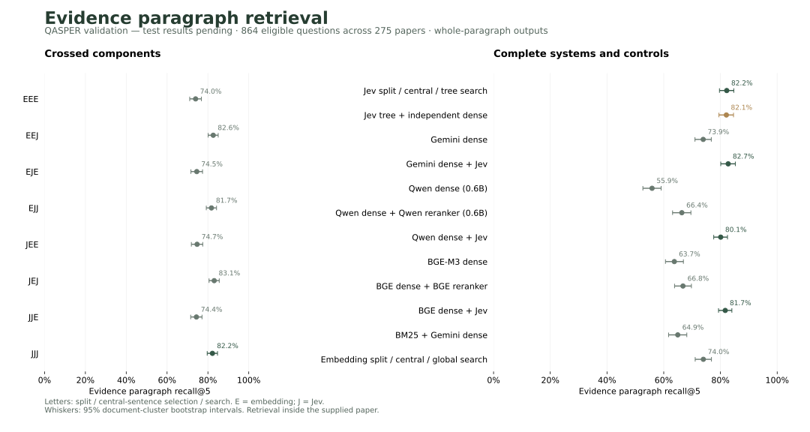

# Whole-paragraph retrieval: completed validation comparison

**Validation results only.** All 18 methods completed 1,005 questions across 281 QASPER papers. The separate 728-question test is not complete; no partial-test accuracy is reported here.

The primary metric uses **864 questions across 275 papers** with a fully aligned, nonempty paragraph-evidence reference. Every method returns whole original paragraphs.

## What the comparison shows

JJJ achieves **82.21% evidence recall@5**, versus **73.91%** for direct Gemini dense retrieval. However, **direct Gemini retrieval + Jev reranking reaches 82.72%** using the same shared search requests. Validation therefore does not establish an advantage for tree traversal over that direct-retrieval control.

The four matched search replacements favor Jev by 7.19–8.64 percentage points, with Holm-adjusted p = 0.0012 in validation. Splitting and central-sentence replacements show no significant validation improvement in their matched comparisons. Same-pool Jev reranking improves over the native compact Qwen and BGE rerankers; all effects and intervals appear below.

The registered system-selection rule compared JJJ with the independent JJJ + dense hybrid and selected **JJJ** before opening the test. JEJ has the highest numerical validation score among the crossed arms, but it was not one of the selectable final-system candidates. All eight arms remain fixed for test evaluation.

These findings concern evidence retrieval inside a supplied paper. They do not establish full-corpus performance, generated-answer quality or superiority over frontier RAG systems.

## Eight crossed configurations

Letters mean **split / central-sentence selection / search**. E uses embeddings; J uses Jev. Embedding search ranks nodes globally across depths. Jev explores the children of retained promising parents from the root downward. Central sentences are cues, while the source remains accessible; paragraph-level decisions use full paragraphs.

| Arm | Recall@5, % [95% CI] | Complete evidence@5, % | F1@5, % |
| --- | ---: | ---: | ---: |
| EEE | 73.96 [71.09, 76.82] | 67.25 | 30.63 |
| EEJ | 82.61 [80.12, 85.04] | 76.85 | 36.59 |
| EJE | 74.54 [71.68, 77.37] | 68.40 | 31.10 |
| EJJ | 81.72 [79.21, 84.22] | 76.16 | 36.27 |
| JEE | 74.70 [71.89, 77.46] | 68.40 | 30.82 |
| JEJ | 83.08 [80.57, 85.55] | 77.43 | 36.74 |
| JJE | 74.36 [71.56, 77.11] | 68.17 | 30.98 |
| JJJ | 82.21 [79.65, 84.70] | 76.50 | 36.41 |

## Complete systems and controls

Gemini and the crossed methods share the same planner requests. Qwen/BGE retain their native original-question interface. Each Jev reranker swap uses the exact dense top-30 candidate pool and full paragraph text used by its corresponding native pipeline; the pool is checked before scoring.

| Method | Recall@5, % [95% CI] | Complete evidence@5, % | F1@5, % |
| --- | ---: | ---: | ---: |
| JJJ | 82.21 [79.65, 84.70] | 76.50 | 36.41 |
| JJJ + independent Gemini dense RRF | 82.08 [79.46, 84.60] | 76.16 | 35.20 |
| Gemini dense (shared requests) | 73.91 [71.01, 76.77] | 66.78 | 30.34 |
| Gemini dense + Jev reranker (shared requests) | 82.72 [80.11, 85.25] | 77.20 | 34.67 |
| Qwen3-Embedding-0.6B | 55.88 [52.65, 59.09] | 49.31 | 22.98 |
| Qwen dense + Qwen3-Reranker-0.6B | 66.38 [63.11, 69.58] | 60.19 | 26.46 |
| Qwen dense + Jev reranker | 80.08 [77.63, 82.48] | 74.19 | 33.62 |
| BGE-M3 dense | 63.74 [60.61, 66.93] | 57.52 | 25.59 |
| BGE dense + BGE-reranker-v2-m3 | 66.78 [63.81, 69.76] | 60.88 | 26.43 |
| BGE dense + Jev reranker | 81.68 [79.31, 84.02] | 75.93 | 34.02 |
| BM25 + Gemini dense RRF | 64.95 [61.71, 68.13] | 58.10 | 26.20 |

## Recall under equal source-token budgets

All methods apply the same whole-paragraph packing rule to their own rankings. Oversized paragraphs are skipped and recorded, never truncated. These budgets count source text, excluding headings and wrappers.

| Method | 512 tokens, % | 1,024 tokens, % | 2,048 tokens, % |
| --- | ---: | ---: | ---: |
| EEE | 66.54 | 83.15 | 92.30 |
| EEJ | 76.36 | 84.92 | 85.86 |
| EJE | 65.90 | 83.23 | 91.95 |
| EJJ | 76.12 | 84.26 | 85.37 |
| JEE | 66.63 | 82.90 | 92.17 |
| JEJ | 76.60 | 84.85 | 85.69 |
| JJE | 66.62 | 83.53 | 92.00 |
| JJJ | 76.49 | 84.68 | 85.75 |
| Gemini dense (shared requests) | 69.61 | 82.70 | 93.55 |
| BM25 + Gemini dense RRF | 59.38 | 77.01 | 91.25 |
| JJJ + independent Gemini dense RRF | 78.59 | 89.43 | 95.77 |
| Qwen3-Embedding-0.6B | 56.77 | 73.44 | 88.22 |
| Qwen dense + Qwen3-Reranker-0.6B | 61.06 | 77.92 | 90.16 |
| BGE-M3 dense | 56.51 | 74.78 | 88.10 |
| BGE dense + BGE-reranker-v2-m3 | 57.81 | 75.30 | 88.31 |
| Qwen dense + Jev reranker | 76.92 | 86.77 | 92.38 |
| BGE dense + Jev reranker | 77.73 | 88.53 | 94.31 |
| Gemini dense + Jev reranker (shared requests) | 78.27 | 88.40 | 95.29 |

At 2,048 source tokens, the independent hybrid reaches **95.77% recall**, compared with **85.75%** for JJJ and **95.29%** for direct Gemini + Jev. This descriptive secondary result shows a benefit from retaining direct retrieval for broader evidence coverage under a larger reading budget. It does not change the registered recall@5 selection rule or the frozen test candidate.

## Matched component effects

| Comparison | Recall difference, percentage points [95% CI] | Holm-adjusted p |
| --- | ---: | ---: |
| EEE -> JEE | +0.73 [-0.59, +2.05] | 1.0000 |
| EJE -> JJE | -0.18 [-1.30, +0.93] | 1.0000 |
| EEJ -> JEJ | +0.47 [-0.79, +1.78] | 1.0000 |
| EJJ -> JJJ | +0.49 [-0.71, +1.70] | 1.0000 |
| EEE -> EJE | +0.58 [-0.95, +2.09] | 1.0000 |
| EEJ -> EJJ | -0.88 [-2.46, +0.64] | 1.0000 |
| JEE -> JJE | -0.34 [-1.70, +1.03] | 1.0000 |
| JEJ -> JJJ | -0.87 [-2.30, +0.50] | 1.0000 |
| EEE -> EEJ | +8.64 [+5.74, +11.48] | 0.0012 |
| EJE -> EJJ | +7.19 [+4.10, +10.20] | 0.0012 |
| JEE -> JEJ | +8.38 [+5.47, +11.25] | 0.0012 |
| JJE -> JJJ | +7.85 [+4.91, +10.79] | 0.0012 |

## Same-pool reranker effects

| Comparison | Recall difference, percentage points [95% CI] | Holm-adjusted p |
| --- | ---: | ---: |
| qwen_rerank -> qwen_jev_rerank | +13.71 [+10.99, +16.54] | 0.0002 |
| bge_rerank -> bge_jev_rerank | +14.90 [+12.23, +17.59] | 0.0002 |

## Population, controls and limitations

There are 864 primary-eligible questions, 28 with text evidence but no fully aligned reference, and 113 without usable text evidence. The latter includes unanswerable, empty and figure-only annotations. All 1,005 questions have predictions for all 18 methods.

A reference must map every non-figure evidence item to an original paragraph exactly or through unambiguous whitespace normalization, and contain at least one paragraph. Each metric uses its best acceptable reference; alternative annotations are never unioned. Raw official string F1 is a separate diagnostic in the summaries.

Development, validation and test are document-disjoint. The 16-paper development pilot fixed settings before validation. The native-heading parser, outside-in central candidates, Bayesian splitting rule, beam 5, acceptance 0.20, refinement below 0.85 and global 30-hit search were frozen. No test-result tuning has occurred.

Intervals use 10,000 paired document-cluster bootstrap draws with question-weighted means. Document-level paired sign randomization supplies two-sided p-values, with Holm adjustment separately across 12 component contrasts and two reranker contrasts. Intervals are marginal rather than simultaneous. These validation statistics do not replace the registered final test comparisons.

Models are Gemini Embedding 2 (768 dimensions), Jev 1.13.0, Qwen3-Embedding-0.6B, Qwen3-Reranker-0.6B, BGE-M3 dense and BGE-reranker-v2-m3. The shared query planner is gpt-6.1-sol; it sees questions, titles and headings. Indexing uses no generative LLM. Exact revisions and source hashes are registered.

Qwen uses compact checkpoints and BGE-M3 uses dense mode. ColBERTv2, RTriever and RAPTOR were not evaluated. Shared caches prevent interpreting stage timings as standalone deployment latency. Public-benchmark exposure during model training cannot be excluded.

## Reproduction and artifacts

[Protocol](TREE_SYSTEM_PROTOCOL.md) · [Registration](registrations/tree-retrieval-v3.json) · [Pre-outcome amendment](registrations/tree-retrieval-v3-jev-rerank-amendment.json) · [Reproduction](RETRIEVAL_V3_REPRODUCTION.md)

[Validation catalog and file hashes](results/tree-retrieval-v3/validation/catalog.json) · [Statistics](results/tree-retrieval-v3/validation/statistics.json) · [Metric summary](results/tree-retrieval-v3/validation/aligned-summary.json)

The export contains all 18,090 method predictions, compressed per-question scores, traversal traces, paragraph packs and reranker pools. The benchmark is [QASPER](https://arxiv.org/abs/2105.03011); these retrieval results are not comparable to the historical answer-based studies.
