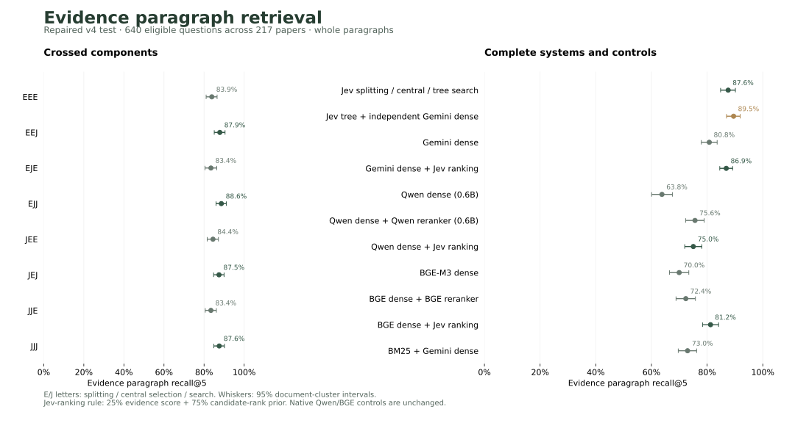

# Repaired paragraph retrieval comparison

Version 4 evaluates **728 questions from 224 QASPER papers**, with all **18 methods** completed. The primary evidence-retrieval metric uses **640 questions from 217 papers** with at least one fully aligned, nonempty paragraph reference. No answer-generation reader is used.

Jev search has higher recall in all four matched configurations; 1 of four comparisons passes the prespecified 12-test Holm correction. JJJ's 0.69-point difference from direct Gemini + Jev ranking is not statistically significant (adjusted p = 0.624). The hybrid has the highest observed recall, 89.51%; JJJ remains the prespecified primary system.

Every result returns whole original paragraphs. The eight crossed configurations, hybrid and Jev-reranked dense controls share the same final rule: the complete original question, complete candidate paragraphs, at most 30 candidates, and five returned paragraphs for the primary score. Final scores combine 25% Jev direct-evidence probability with 75% normalized candidate-rank prior. Central sentences guide navigation; they do not replace the source paragraphs.

For candidate position i starting at zero in a pool of n paragraphs, the final score is `0.25 * Jev probability + 0.75 * (1 - i / max(1, n - 1))`. Ties preserve candidate order. This is a retrieval pipeline comparison, not a claim that pure Jev scores alone outperform every native reranker.

## All eight crossed configurations

Letters mean **splitting / central-sentence selection / search**. E means embeddings and J means Jev. E search scores all depths globally. J evaluates children of retained parents layer by layer. **The common final Jev reranker is outside these three factors**, including for EEE.

| Arm | Evidence recall@5, % [95% CI] | Complete evidence@5, % | Evidence F1@5, % |
| --- | ---: | ---: | ---: |
| EEE | 83.86 [81.04, 86.51] | 80.47 | 33.66 |
| EEJ | 87.87 [85.08, 90.46] | 84.53 | 36.40 |
| EJE | 83.42 [80.47, 86.33] | 79.84 | 33.37 |
| EJJ | 88.61 [85.97, 91.10] | 85.31 | 36.52 |
| JEE | 84.44 [81.56, 87.16] | 80.94 | 33.79 |
| JEJ | 87.45 [84.75, 89.98] | 83.44 | 36.00 |
| JJE | 83.42 [80.58, 86.14] | 80.00 | 33.26 |
| JJJ | 87.56 [84.83, 90.16] | 84.38 | 36.18 |

## Complete systems and external baselines

Native Qwen and BGE predictions were reused unchanged from the completed frozen baseline runs. Their Jev variants hold the dense top-30 candidate pool and original question fixed. Direct Gemini uses the same shared search requests as the factorial. The hybrid fuses independent Jev-tree and direct-embedding candidates before final Jev reranking.

| System | Evidence recall@5, % [95% CI] | Complete evidence@5, % | Evidence F1@5, % |
| --- | ---: | ---: | ---: |
| Jev splitting, central sentences and tree search | 87.56 [84.83, 90.16] | 84.38 | 36.18 |
| Independent Jev tree + direct Gemini retrieval | 89.51 [86.97, 91.88] | 86.41 | 36.36 |
| Gemini Embedding 2, direct paragraphs | 80.78 [77.91, 83.60] | 76.88 | 31.62 |
| BM25 + direct Gemini, RRF | 72.97 [69.63, 76.23] | 68.75 | 28.25 |
| Qwen3 Embedding 0.6B | 63.77 [60.06, 67.52] | 58.91 | 24.74 |
| Qwen3 Embedding + Qwen3 Reranker 0.6B | 75.64 [72.27, 78.96] | 71.88 | 28.95 |
| BGE-M3 dense | 69.97 [66.47, 73.41] | 66.09 | 26.95 |
| BGE-M3 + BGE Reranker v2-M3 | 72.35 [68.84, 75.79] | 68.75 | 27.42 |
| Qwen3 Embedding + Jev reranking | 75.04 [71.96, 78.09] | 70.00 | 29.21 |
| BGE-M3 + Jev reranking | 81.22 [78.35, 84.12] | 77.66 | 31.63 |
| Direct Gemini + Jev reranking | 86.87 [84.54, 89.17] | 83.44 | 34.77 |

## Matched component comparisons

Each comparison changes one factor and holds the other two fixed. Differences are the second arm minus the first, in percentage points. Twelve component tests form one Holm family.

| Change | Recall@5 difference [95% CI], points | Holm-adjusted p |
| --- | ---: | ---: |
| EEE -> JEE | +0.58 [-0.67, +1.91] | 1.0000 |
| EEJ -> JEJ | -0.41 [-2.10, +1.33] | 1.0000 |
| EJE -> JJE | -0.01 [-0.98, +0.97] | 1.0000 |
| EJJ -> JJJ | -1.05 [-2.67, +0.54] | 1.0000 |
| EEE -> EJE | -0.44 [-2.18, +1.33] | 1.0000 |
| EEJ -> EJJ | +0.75 [-0.72, +2.20] | 1.0000 |
| JEE -> JJE | -1.02 [-2.51, +0.43] | 1.0000 |
| JEJ -> JJJ | +0.10 [-1.67, +1.89] | 1.0000 |
| EEE -> EEJ | +4.00 [+0.92, +7.29] | 0.1610 |
| EJE -> EJJ | +5.19 [+2.06, +8.40] | 0.0192 |
| JEE -> JEJ | +3.02 [+0.01, +6.16] | 0.5543 |
| JJE -> JJJ | +4.14 [+0.93, +7.43] | 0.1375 |

## Prespecified JJJ system comparisons

| Change | Recall@5 difference [95% CI], points | Holm-adjusted p |
| --- | ---: | ---: |
| gemini_dense -> JJJ | +6.78 [+3.61, +9.92] | 0.0010 |
| bm25_dense_rrf -> JJJ | +14.59 [+10.82, +18.39] | 0.0010 |
| hybrid -> JJJ | -1.95 [-3.78, -0.29] | 0.0592 |
| qwen_dense -> JJJ | +23.79 [+19.67, +27.92] | 0.0010 |
| qwen_rerank -> JJJ | +11.91 [+8.24, +15.64] | 0.0010 |
| bge_dense -> JJJ | +17.59 [+13.39, +21.75] | 0.0010 |
| bge_rerank -> JJJ | +15.21 [+11.31, +19.09] | 0.0010 |
| qwen_jev_rerank -> JJJ | +12.52 [+9.16, +15.96] | 0.0010 |
| bge_jev_rerank -> JJJ | +6.34 [+3.00, +9.58] | 0.0010 |
| gemini_jev_rerank -> JJJ | +0.69 [-2.12, +3.39] | 0.6241 |

## Same-pool native versus Jev rerankers

| Change | Recall@5 difference [95% CI], points | Holm-adjusted p |
| --- | ---: | ---: |
| qwen_rerank -> qwen_jev_rerank | -0.60 [-3.52, +2.15] | 0.6812 |
| bge_rerank -> bge_jev_rerank | +8.87 [+5.91, +11.83] | 0.0002 |

## Equal source-token budgets

Whole paragraphs are packed in ranked order under the same token cap. Oversized paragraphs are skipped and logged; no paragraph is truncated. These are secondary metrics.

| System | Recall, 512 tokens | Recall, 1,024 tokens | Recall, 2,048 tokens |
| --- | ---: | ---: | ---: |
| Jev splitting, central sentences and tree search | 84.14% | 91.71% | 94.93% |
| Independent Jev tree + direct Gemini retrieval | 86.77% | 93.52% | 97.87% |
| Gemini Embedding 2, direct paragraphs | 77.87% | 88.85% | 97.13% |
| BM25 + direct Gemini, RRF | 66.83% | 82.29% | 95.24% |
| Qwen3 Embedding 0.6B | 65.77% | 80.77% | 93.49% |
| Qwen3 Embedding + Qwen3 Reranker 0.6B | 70.95% | 84.95% | 94.25% |
| BGE-M3 dense | 64.81% | 80.55% | 92.27% |
| BGE-M3 + BGE Reranker v2-M3 | 64.47% | 82.41% | 92.52% |
| Qwen3 Embedding + Jev reranking | 75.48% | 86.14% | 94.86% |
| BGE-M3 + Jev reranking | 75.72% | 86.79% | 93.97% |
| Direct Gemini + Jev reranking | 83.71% | 91.43% | 97.29% |

## Design and scoring

Repairs were checked on a fixed 16-paper development pilot before the v4 test manifest was frozen. Three final-ranking instructions/aggregations were examined on the same candidates. A cached sweep of direct-evidence weights 0, 0.25, 0.5, 0.75 and 1 selected 0.25 by JJJ development recall@5. Those development scores are tuning results, not held-out evidence. Earlier v3 validation informed the repairs. JJJ was fixed as the primary system before opening test outcomes; the best test row is not used to select a new primary system. Test questions and documents had previously been processed under v3, but test evidence labels and scores were unopened until the complete v4 prediction audit passed.

The shared, previously frozen gpt-6.1-sol planner sees questions, titles and headings. Its evidence needs are augmented with the literal original question for every factorial arm and direct Gemini search. Indexing uses no generative LLM. Native heading nesting is restored for every arm. Jev uses beam 5, acceptance 0.20, additional source inspection below 0.85, and at most 4,096 decisions per search. Scored terminal paragraphs remain eligible for final ranking. Embedding search uses 30 global node hits per need. Central selection uses eight outside-in candidates without early stopping. Splitting settings and model versions are recorded in the manifest.

Evidence must align to an original paragraph exactly or by unambiguous whitespace normalization. An acceptable reference must map all non-figure text evidence and contain at least one paragraph. Each metric uses its best acceptable reference; references are not unioned. Questions with no eligible reference receive predictions but are excluded from the paragraph-evidence denominator.

There are 88 questions outside that denominator, including 3 with text evidence but no fully aligned reference. Unanswerable, empty and figure-only evidence are not awarded artificial retrieval credit.

Confidence intervals use 10,000 paired document-cluster bootstrap draws and question-weighted means. Two-sided document sign randomization supplies p-values. Holm adjustment is separate for 12 component, 10 system and two native-reranker comparisons. Intervals are marginal, not simultaneous.

This is retrieval within a supplied paper, not retrieval over a full corpus. Qwen uses compact 0.6B checkpoints and BGE-M3 uses dense mode. This comparison does not establish frontier or universal superiority. Model training exposure to public benchmark data cannot be excluded. Shared caches make recorded operation times unsuitable for standalone latency comparisons. V3 validation and v4 test use different pipelines and must not be compared as an isolated repair-effect estimate.

## Reproduction

[Frozen manifest](results/tree-retrieval-v4/test/manifest.json) · [Artifact catalog](results/tree-retrieval-v4/test/catalog.json) · [Statistics](results/tree-retrieval-v4/test/statistics.json) · [Conformance audit](results/tree-retrieval-v4/test/conformance.json)

The catalog contains compressed per-question paragraph rankings, traversal traces, candidate pools and scores, with SHA-256 hashes. Provider credentials, spending ledgers and private failure investigations are excluded. The source dataset is [QASPER](https://arxiv.org/abs/2105.03011).

With the prepared, hashed QASPER allocation and model caches described by the manifest, run `python scripts/run_retrieval_v4.py test`, `python scripts/retrieval_v4.py validate test`, then `python scripts/retrieval_v4_evaluate.py test`. The runtime wrapper only retries temporary Windows file locks; its hash is recorded separately from the frozen inference sources. Native baseline files are reused; their models are not executed again.
