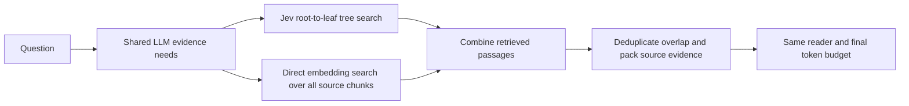

# Comparing decision models and embeddings across the indexing system

Updated 2026-10-05. This is the new research direction. The existing split/pipeline comparison remains useful; the 64-question flat-reranking screen is historical development evidence. It does not establish the value of central sentences or hierarchical search.

**Status:** component APIs and offline control tests are implemented. This document defines the experiment design, not a completed result or a frozen live-run registration. Before live inference, save and publish the exact data IDs, source/model hashes, settings, cost preflight and complete method list. No validation or test outcomes have been opened.

## Questions and controlled comparisons

| Question | Change | Hold fixed | Main measurement |
| --- | --- | --- | --- |
| Does decision-based splitting help? | Jev fixed-anchor probability-drop cuts vs adjacent-embedding semantic cuts | Source parsing, native structure, representative method, search and reader | Evidence recovery and final QA |
| Do Jev central sentences help? | Jev contextual representativeness vs embedding centrality | Exact tree topology, node IDs, source offsets, candidate order/budget and router | Branch retention, evidence recovery and final QA |
| Does Jev tree search help? | Jev routing vs embedding routing | Exact tree and representatives, shared LLM proposals, beam, exposure limits and reader | Missed branches, evidence recall, QA and query usage |
| Does the whole system help? | Complete Jev system vs complete embedding systems | Questions, source documents, reader, final context budget and scoring | QA, evidence, indexing cost and query cost |
| Do independent retrieval paths complement each other? | Jev tree output plus direct dense retrieval vs either path alone | Source, query inputs, common evidence packing and final reader | Rescue rate, regressions and net QA gain |

The statistical prior and drop criterion remain one splitting method. There is no separate prior ablation. Jev evidence judgments and embedding similarity are different learned signals; neither is treated as ground-truth semantics.

## Component matrix

Evaluate the complete 2 × 2 × 2 design on development data, so representative and search changes cannot hide a different segmentation. `E` denotes an embedding component; `J` denotes Jev.

| Arm | Split | Central sentences | Root-to-leaf routing |
| --- | --- | --- | --- |
| EEE | E | E | E |
| EJE | E | J | E |
| EEJ | E | E | J |
| EJJ | E | J | J |
| JEE | J | E | E |
| JJE | J | J | E |
| JEJ | J | E | J |
| JJJ | J | J | J |

For central sentences, compare EEE/EJE, EEJ/EJJ, JEE/JJE and JEJ/JJJ. For routing, compare EEE/EEJ, EJE/EJJ, JEE/JEJ and JJE/JJJ. Report every contrast and the interaction between representatives and routing; do not select only favorable pairs.

Native titles, headings and contents are parsed identically without Jev or a generative LLM. The embedding split control retains the previous adjacent-paragraph cosine-distance rule with an 85th-percentile threshold within headings. The Jev split retains its fixed anchor, prior 0.7, cutoff 0.5 and minimum drop 0.2. These are separate partition algorithms, not two probability-calibrated versions of one rule.

For the representative control, freeze a partition once and use `reselect_representatives` to change only paragraph/topic representatives. Both selectors see the same full node context and the same outside-in candidate schedule. The planned bounded setting is eight candidates per target, with all sentences used when there are fewer. The embedding baseline computes exact mean cosine to other sentences using a sum of normalized vectors; it embeds all context sentences, even when only eight candidates are eligible. Jev judges each eligible source sentence against the full node context. Record actual embeddings, decisions, input tokens and latency separately. Representatives are exact source sentences, not generated summaries. Candidate limits are compute settings, not evidence of representative quality.

## LLM proposal followed by root-to-leaf search

The query LLM proposes one to three evidence needs from the original question, options where applicable, document title and native headings. It receives no gold labels, reference answers or method-specific central sentences. Generate its plan once per question and reuse the exact plan across component arms. The planner requests evidence rather than guessing an answer.

Search starts at the root, then descends through native headings, topic blocks, paragraphs and sentence leaves. At each round the router sees only reached child previews: heading paths and each child's central sentence, or its exact text for a sentence leaf. It never receives full unseen descendant text. Jev uses a dedicated routing decision about whether a preview suggests a promising subtree; this differs from claiming the preview already answers the question. Embedding routing compares the same preview information with the same question/need.

Proposed starting controls are beam width 2 per need, at most 16 levels, 256 node scores, and 8,192 tokens of routing payload across all needs. Check a whole round against the budget before scoring any sibling, preventing silent source-order truncation. Record budget failures as outcomes. Reached leaves identify paragraphs to read; final evidence comes from their exact source text. A reference in a heading or central sentence alone is not counted as retrieved evidence.

Previews contain less text than flat candidate passages. Equal token ceilings do not imply equal information or compute. Report routing payload, candidate source tokens, model prompt tokens, embeddings, decisions and reader tokens separately. Shared caching lowers actual experimental spending; logical per-method usage must still include the work each system would require alone.

## Hybrid means two independent retrieval paths

There is **no hybrid routing arm**. The Jev route remains Jev-only. The embedding path searches the full canonical chunk collection independently, including branches the tree never visits. Combining their final candidate passages allows one path to recover a miss from the other.

The initial fusion rule is equal-weight reciprocal-rank fusion with constant 60. It does not average cosine similarity with Jev probabilities. Exact duplicate spans receive support from both paths; overlapping selected spans are merged for reading and counted once, without filling unselected gaps. Freeze the fusion rule before inference. Do not tune it on validation/test results.

Use the same source-union renderer for Jev-only, dense-only and combined arms, all capped at 2,048 final tokens. Include a compute-matched hybrid, splitting its candidate/preview allowance equally between the two paths, and a full-allowance hybrid as a separately labeled cost/quality comparison. Combining two full retrieval budgets must not be described as a free gain. Inspect rescue rate and harmful replacement cases on development: what dense retrieval finds outside the visited tree, what the tree finds below the dense shortlist, and what fusion loses to packing.

## Strong complete-system baselines

The complete comparison must include direct dense retrieval, BM25+dense reciprocal-rank fusion, and a strong reranked embedding/hybrid pipeline under the same final reader. Preserve both recursive and semantic chunking controls. A reranker sees only its supplied source pool and receives a matched candidate-token allowance. Query proposals are shared in the matched comparison; a conventional original-question-only baseline can be reported separately with its lower query cost.

Add an upstream published hierarchical embedding method with pinned code and explicit model substitutions. The existing [RAPTOR adapter](RAPTOR_BASELINE.md) is the first target; its real upstream clustering/tree/collapsed retrieval has passed offline checks, but live measured QA is pending. RAPTOR's generated summaries change indexing cost and evidence provenance, which must be reported. [Official RAPTOR implementation](https://github.com/parthsarthi03/raptor).

Dense retrieval followed by a stronger pairwise reranker is a standard strong control, not just dense nearest-neighbor lookup. [Sentence Transformers retrieve-and-rerank documentation](https://sbert.net/examples/sentence_transformer/applications/retrieve_rerank/README.html). An additional parent-merging baseline can follow a pinned upstream implementation, which retrieves leaves and merges enough related leaves into parents; it must not be confused with root-to-leaf routing. [LlamaIndex AutoMergingRetriever](https://developers.llamaindex.ai/python/framework/integrations/retrievers/auto_merging_retriever/).

## Data, metrics and failure analysis

Start the measured component comparison on the complete **384 exposed development questions across 307 documents**, rather than the previous 128-question screen. Expand successful configurations onto additional development documents before freezing at most three validation candidates. The [existing document-disjoint registry](ITERATION_PROTOCOL.md) remains authoritative: 1,425 validation and 1,559 test questions remain closed. Reusing already inspected development documents does not make them held out.

Primary outcomes remain official QASPER answer F1 and QuALITY-HARD accuracy, reported separately. Use the same reader prompt/model and one isolated reader call per distinct input in development; share identical input predictions across arms. Freeze the number of reader replicates before validation. Preserve all questions, abstentions, failures and incomplete retrievals in their denominators.

On QASPER, measure final source-paragraph evidence recall, complete evidence recovery and evidence F1. After retrieval, score where annotated evidence branches were pruned and whether relevant candidate paragraphs survived packing. Do not use QA evidence annotations as gold labels for the subjective question "which sentence is central?" Evaluate representatives through their controlled downstream effects; an independent blinded human study would be a separate measurement. QuALITY has no equivalent official passage labels, so do not fabricate them.

Log indexing failures, malformed replies, negative/contradictory evidence, generic headings, misleading representatives, early branch pruning, excessive depth, oversized paragraphs and packing losses. Keep exact source offsets, node paths, selected/rejected previews and usage. All indexing is question-independent. Gold data enters only post-inference scoring.

Publish paired document-bootstrap intervals for development and every registered arm, including losses. The existing untouched-test criterion and multiple-comparison correction still apply to any frontier claim. This component design answers why a system changes; the final whole-system comparison answers whether that change improves practical retrieval and QA.

## Implementation and execution gate

Implemented APIs: `build_index(..., representative_scorer=...)`, `reselect_representatives`, `CentroidRepresentatives`, `JevScorer.route`, `EmbeddingTreeRouter`, `propose_needs`, `search_tree`, `tree_passages`, `EmbeddingPassageRetriever`, and `fuse_retrieval_paths`. Offline fixtures verify independent stages, matching preview exposure, branch-only traversal, budgets, direct-path recovery and exact source packing. They are software checks, not benchmark scores.

Still required before a live comparison: canonical benchmark-to-tree assembly for both partitions, batched audited model callbacks, a complete-run manifest and resume/replay harness, baseline adapters, and a cost/call preflight. Reuse content-addressed data and model outputs when inputs and model settings match exactly. All Gemini reservations continue under the existing **$30 total cap**; Codex usage is recorded rather than called free. Never open held-out data to debug these adapters.
